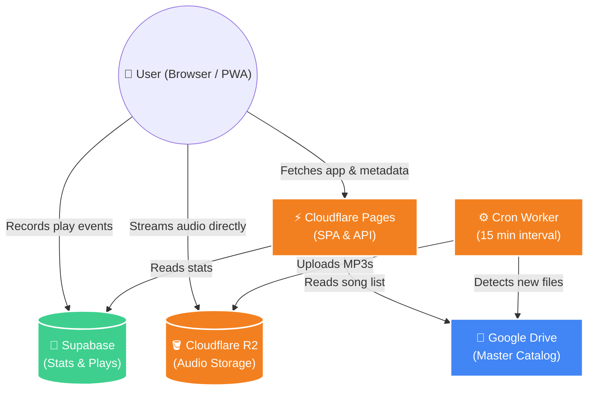
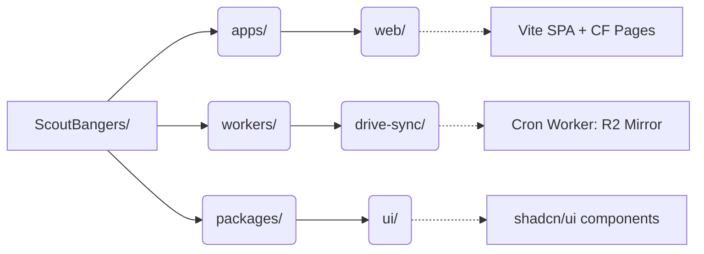

<div align="center">
  
  
  # ScoutBangers
  
  **A Scout minimalist, mobile-first web music player.**
  
  [](https://react.dev/)
  [](https://vitejs.dev/)
  [](https://tailwindcss.com/)
  [](https://pages.cloudflare.com/)
</div>

<br/>

> **ScoutBangers** is a PWA-enabled music player. It fetches audio directly from a public Google Drive folder, mirrors it hourly into Cloudflare R2 for **zero egress fees**, and provides a seamless mobile experience.

---

## ✨ Features

- 📱 **Mobile-First & PWA:** Installable directly to your iOS or Android home screen.
- 🎨 **Minimal UI:** Built with shadcn/ui and Tailwind CSS.
- 💾 **Zero Egress Fees:** Audio is served directly from Cloudflare R2 (`audio.scoutbangers.com`).
- 🔄 **Automated Sync:** A Cloudflare Cron Worker keeps the R2 bucket in perfect sync with Google Drive.
- 📊 **Rich Analytics:** Top songs, daily activity charts, and listener statistics via Supabase.

---

## 🏗️ Architecture



---

## 🚀 Quick Start (Local Development)

### 1. Start the SPA
```bash
npm install
cd apps/web
cp .env.example .env.local      # Fill DRIVE_API_KEY and DRIVE_FOLDER_ID
cd ../..
npm run dev                     # Boots Vite dev server on :5173
```

### 2. Run API Functions Locally
The `dev` command only runs the SPA. To test `/api/songs` and `/api/lyrics` locally, use Wrangler:
```bash
npm install -g wrangler
cd apps/web
npm run build
npx wrangler pages dev dist     # Serves SPA + functions on :8788
```

---

## 📁 Project Structure



---

## ☁️ Deploying to Cloudflare (100% Free)

You need three pieces: an **R2 bucket**, a **Pages project**, and a **Worker**.

### 🪣 1. R2 Bucket
1. Cloudflare Dashboard → **R2** → *Create bucket* (`scoutbangers-audio`).
2. **Settings** → **Custom domains** → Connect `audio.scoutbangers.com`.

### ⚙️ 2. Drive → R2 Sync Worker
```bash
cd workers/drive-sync
npm install
npx wrangler login                                   # One-time login
npx wrangler secret put GOOGLE_SERVICE_ACCOUNT_JSON  # Service-account JSON
npx wrangler secret put SYNC_TOKEN                   # Random secure string
npx wrangler deploy
```
*Trigger the initial backfill manually:*
```bash
curl "https://scoutbangers-drive-sync.<your-account>.workers.dev/?token=<SYNC_TOKEN>"
```

### 🌍 3. Pages Project
Cloudflare Dashboard → **Pages** → **Create** → **Connect to Git**.

| Setting | Value |
|---------|-------|
| **Framework preset** | None |
| **Build command** | `npm install && npm run build --filter=scoutbangers-web` |
| **Build output directory** | `apps/web/dist` |
| **Root directory** | `/` |

**Required Environment Variables:**
- `DRIVE_FOLDER_ID`
- `LYRICS_DRIVE_FILE_ID`
- `VITE_AUDIO_BASE_URL` (`https://audio.scoutbangers.com`)
- `VITE_SUPABASE_URL`
- `VITE_SUPABASE_ANON_KEY`
- `GOOGLE_REFRESH_TOKEN`
- `GOOGLE_CLIENT_ID`
- `GOOGLE_CLIENT_SECRET`

---

## 🎨 Customisation

- **Palette**: Edit `packages/ui/src/styles/globals.css` (the `:root` block). The app dynamically updates based on these CSS variables!
- **Logo**: Replace `apps/web/public/SB.png`.

---

## 🛠️ Handy Scripts

| Command | Description |
|---|---|
| `npm run dev` | 💻 Starts Vite dev server |
| `npm run build` | 🏗️ Type-check + Vite production build |
| `npm run typecheck` | 🔍 Runs `tsc --noEmit` across all workspaces |
| `npm run lint` | 🧹 Runs ESLint |
| `npm run format` | 💅 Formats code via Prettier |

---

<div align="center">
  <p><i>Private — no license granted. Built for personal use.</i></p>
</div>
